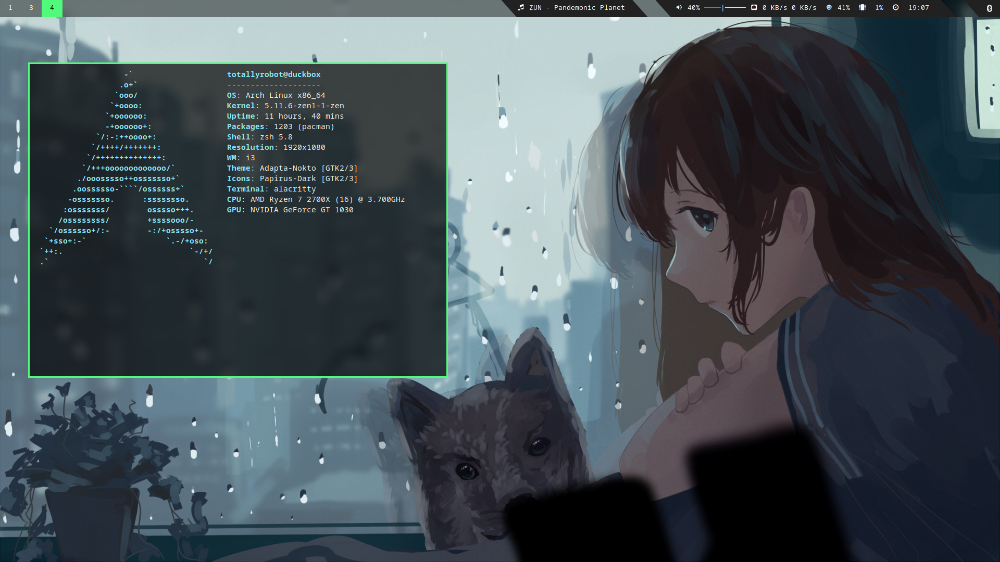

# TotallyRobot's dotfiles
my dotfiles using neovim, zsh, powerlevel10k, xfce, rofi, alacritty, picom, and i3
## Screenshot

## dependencies (arch)

	nvim
	zsh
	zsh-theme-powerlevel10k-git (aur)
	xfce4-panel
	xfce4-pulseaudio-plugin
	xfce4-notifyd
	xfce4-whiskermenu-plugin
	xfce4-mpc-plugin
	mpc
	ncmpcpp
	pactl
	hsetroot
	rofi
	picom-jonaburg-git (aur)
	i3-gaps
	alacritty

